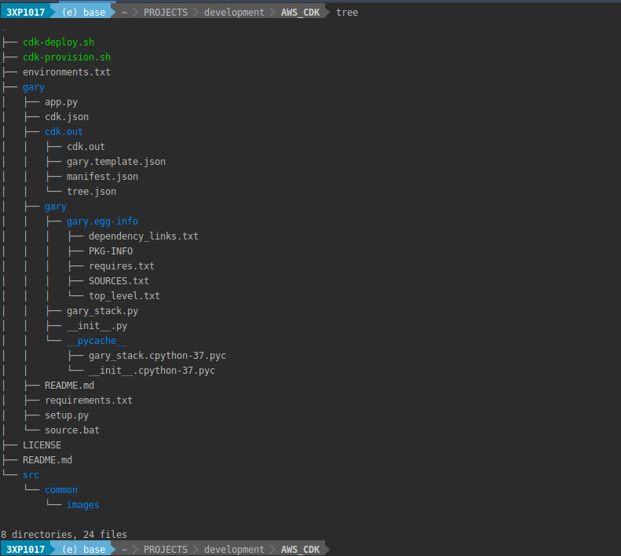
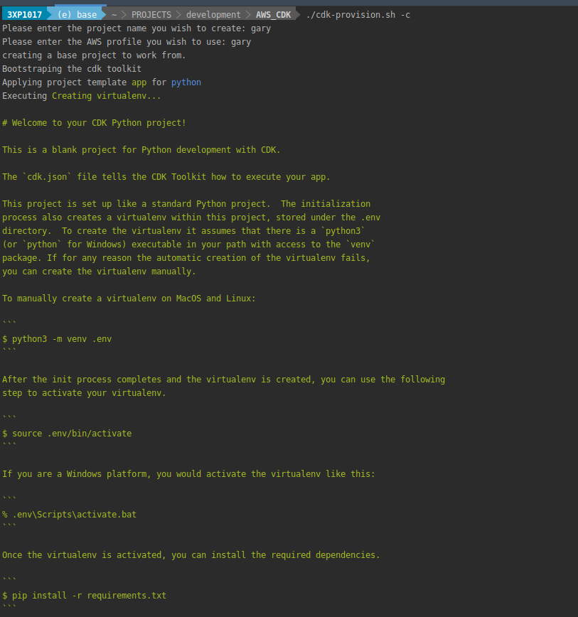
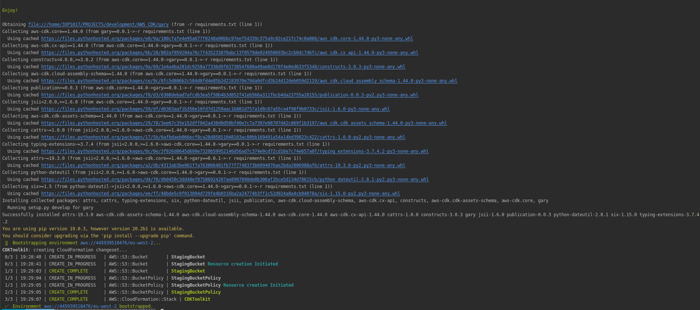

# AWS_CDK
Tinkering with amazons cloud development kit and python.

in order to get some functionality of this script to work you will need to
remove the <MY_AWS_ACCOUNT_ID> and replace it with the account id e.g. 3333343434

the repository includes a shell script that will provide you with the ability to
- [x] bootstraps the cdk toolkit into an account/region
- [x] create a blank CDK project in python using the 'app' template
- [x] initialize the cdk app onto AWS using the cdk init feature
- [x] deploy your app to cloudformation using the cdk-deploy feature

this project does not cover the following as of yet.

- [x] updating the CDK app
- [x] removing the CDK app
- [x] support of languages other than python


Folder structure:



Expected output: ```./cdk-provision -c```




